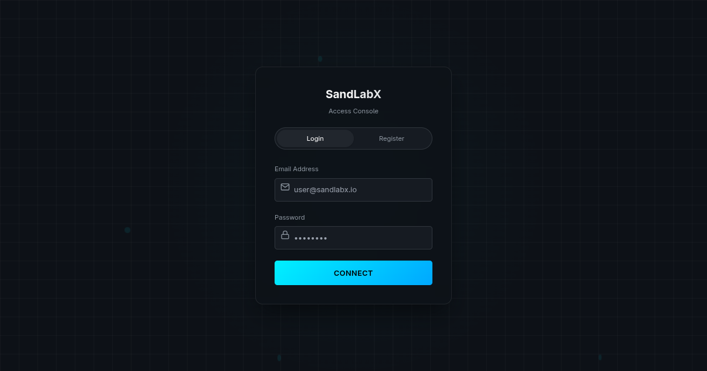
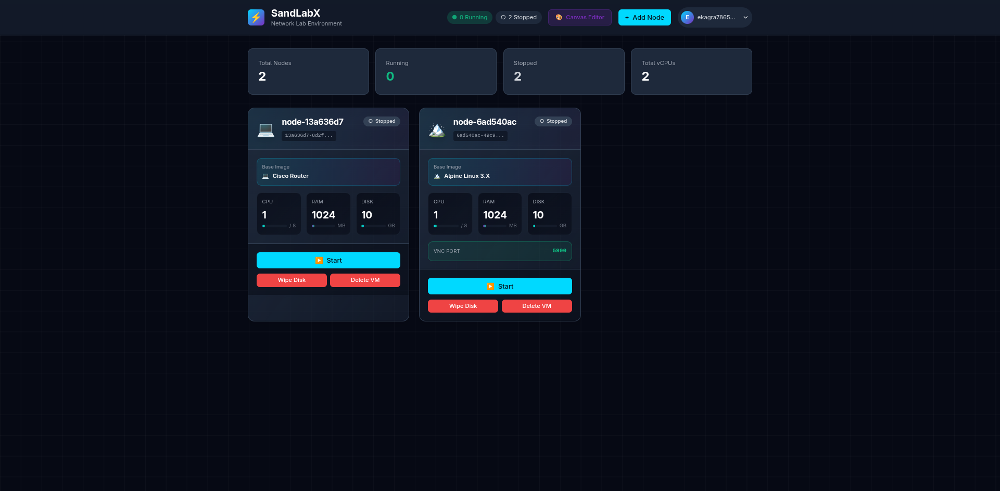
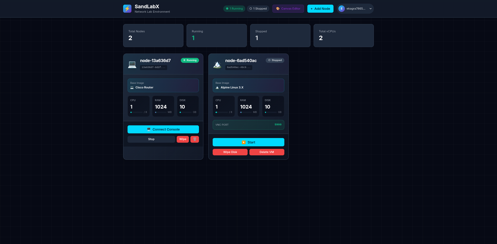
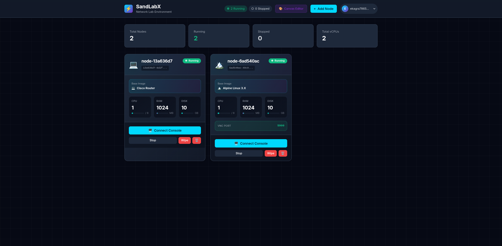
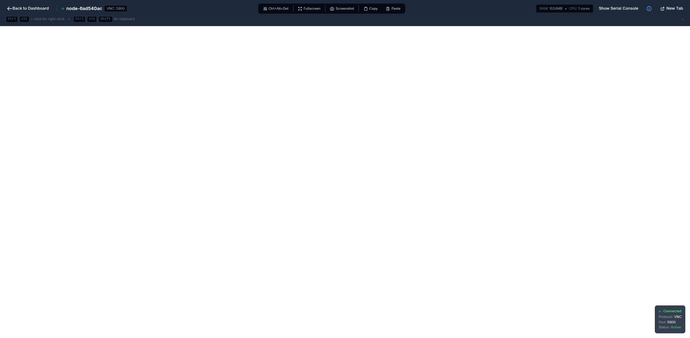
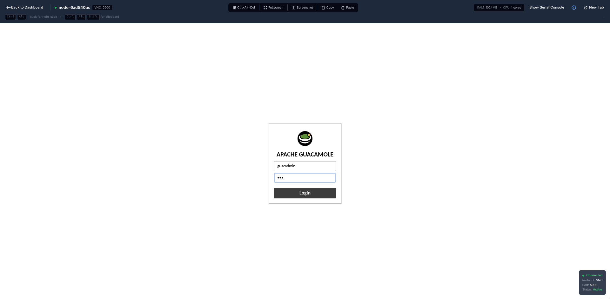
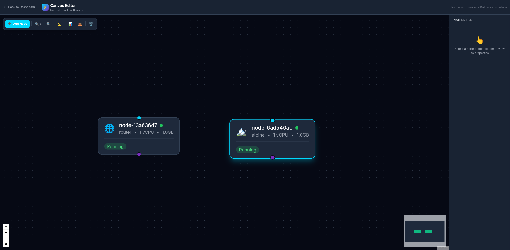
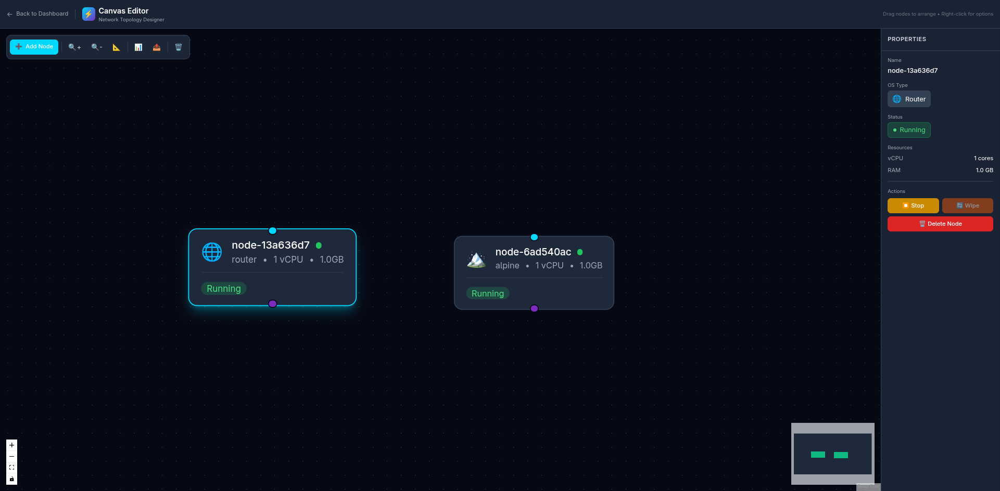
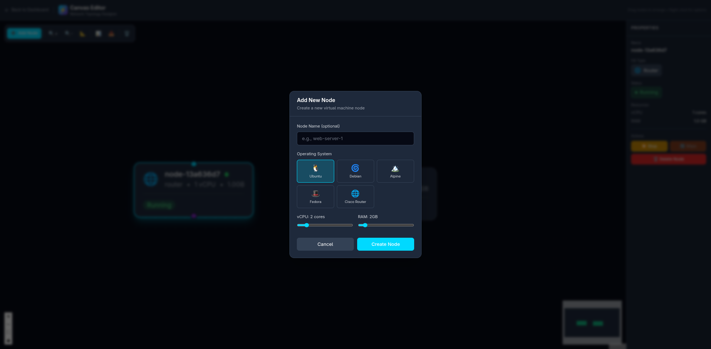

# SandBoxLabs - Network Lab with QEMU and Guacamole

> **Internship Take-Home Project by Pownraj @ SandBoxLabs**  
> Deadline: October 21, 2025

A complete prototype for creating and managing virtual machine nodes in a network lab using QEMU disk overlays and Apache Guacamole browser-based console.

## 📚 Documentation Quick Links

- **[Quick Start Guide](./QUICK-START.md)** - Get running in 1 command
- **[Persistence Architecture](./PERSISTENCE.md)** - VM data persistence explained
- **[Project Summary](./PROJECT-SUMMARY.md)** - Overview and deliverables
- **[Project Structure](./STRUCTURE.md)** - Directory layout
- **[Cheat Sheet](./CHEAT-SHEET.txt)** - Command reference
- **[Backend API Docs](./backend/README.md)** - API endpoints
- **[Frontend Docs](./frontend/README.md)** - UI components
- **[Documentation Index](./docs/README.md)** - All docs

## 🎯 Project Status: 95% Complete ✅

### ✅ Fully Implemented
- ✅ **Infrastructure** (Docker Compose, Guacamole, PostgreSQL, Guacd)
- ✅ **Backend API** (Node.js/Express with all 5+ endpoints)
- ✅ **Frontend UI** (Next.js/React with full node management)
- ✅ **QEMU Integration** (Overlay system, process management)
- ✅ **Guacamole Integration** (Auto-registration, URL generation)
- ✅ **State Management** (JSON persistence)
- ✅ **Documentation** (Complete guides and READMEs)
- ✅ **Custom ISO Support** (Install any OS from ISO - Bazzite, Fedora, etc.)

### ⏳ Remaining (5%)
- ⏳ End-to-end testing with real VMs

## 🏗️ Complete Architecture

```
┌─────────────────────────────────────────────────────────────┐
│                         USER BROWSER                         │
│                    http://localhost:3000                     │
└────────────────────────────┬────────────────────────────────┘
                             │
                    ┌────────▼────────┐
                    │  Frontend (UI)  │  Next.js/React
                    │   Port 3000     │  Node Management
                    └────────┬────────┘
                             │ REST API
                    ┌────────▼────────┐
                    │  Backend API    │  Node.js/Express
                    │   Port 3001     │  /api/nodes
                    └────┬────────┬───┘
                         │        │
           ┌─────────────┘        └──────────────┐
           │                                     │
    ┌──────▼──────┐                     ┌───────▼────────┐
    │   QEMU      │                     │  Guacamole DB  │
    │  Manager    │                     │  (PostgreSQL)  │
    │ (Overlays)  │                     │   Port 5432    │
    └──────┬──────┘                     └───────┬────────┘
           │                                    │
    ┌──────▼──────────┐              ┌─────────▼──────────┐
    │  QEMU VMs       │              │    Guacamole Web   │
    │  VNC: 5900+     │◄─────────────┤    Port 8081       │
    │  (node_*.qcow2) │     VNC      └────────┬───────────┘
    └─────────────────┘              ┌────────▼───────────┐
                                     │      Guacd         │
                                     │   VNC Proxy 4822   │
                                     └────────────────────┘
```

## 🚀 Complete Quick Start Guide

### Prerequisites

**System Requirements:**
- Docker and Docker Compose
- Node.js 18+ and npm
- 4GB+ available RAM
- Ports available: 3000, 3001, 8081, 5900+

**Optional (for VM operations):**
- QEMU/KVM (`qemu-system-x86_64`, `qemu-img`)
- Install: `sudo apt-get install qemu-system-x86 qemu-utils`

### Installation Steps

#### 1. Clone and Setup
```bash
cd /path/to/sandboxlabs

# Run complete setup (installs all dependencies)
./setup-all.sh
```

#### 2. Start Docker Services
```bash
# Start Guacamole, PostgreSQL, Guacd
docker-compose up -d

# Verify all containers are running
docker-compose ps
```

#### 3. Start Backend API
```bash
# Terminal 1
cd backend
npm start

# Or use the startup script
./start-backend.sh
```

Backend API runs on: **http://localhost:3001**

#### 4. Start Frontend
```bash
# Terminal 2 (new terminal)
cd frontend
npm run dev
```

Frontend UI runs on: **http://localhost:3000**

### Access Points

Once everything is running:

| Service | URL | Purpose |
|---------|-----|---------|
| **Frontend UI** | http://localhost:3000 | Main application interface |
| **Backend API** | http://localhost:3001/api | REST API endpoints |
| **Guacamole** | http://localhost:8081/guacamole | Direct console access |
| **API Health** | http://localhost:3001/api/health | Health check |

**Guacamole Credentials:**
- Username: `guacadmin`
- Password: `guacadmin`

### Using the Application

1. **Open Frontend**: http://localhost:3000
2. **Create Node**: Click "Add Node" button
3. **Start Node**: Click "Run" button on a node
4. **Connect**: Click "Connect" to open console in Guacamole
5. **Stop Node**: Click "Stop" button
6. **Wipe Node**: Click "Wipe" to reset to clean state

---

## 📖 User Guide - Step by Step Demo

This section provides a complete visual walkthrough of SandBoxLabs from a student user's perspective, demonstrating both **Dashboard Mode** and **Canvas Editor Mode**.

### 1. Login to SandLabX

Start by navigating to `http://localhost:3000` and logging in with your credentials.



**Test Credentials:**
- Email: `ekagra7865@gmail.com`
- Password: `123nakshatra`

---

### 2. Dashboard Overview

After login, you'll see the main dashboard showing all your virtual machines (nodes). The dashboard displays:

- **Statistics**: Total nodes, running/stopped counts, total vCPUs
- **Node Cards**: Each VM is displayed as a card with details
- **Quick Actions**: Start, Stop, Wipe, Delete buttons per node
- **Navigation**: Access to Canvas Editor mode via top navigation



In this example, there are 2 existing nodes:
- **Cisco Router** (💻 node-13a636d7) - Stopped, 1 CPU, 1024MB RAM
- **Alpine Linux** (🏔️ node-6ad540ac) - Stopped, 1 CPU, 1024MB RAM, VNC port 5900

---

### 3. Starting Virtual Machines

Click the **"▶️ Start"** button on any node to boot the virtual machine. The system will:

1. Allocate VNC port (if using VNC console)
2. Spawn QEMU process with your configured resources
3. Connect to Guacamole for console access
4. Update status to "Running"



**Status Indicators:**
- **● Green** = Running
- **○ Gray** = Stopped

---

### 4. Both VMs Running

You can run multiple VMs simultaneously. The header statistics update in real-time:



Notice:
- Header now shows **"● 2 Running"** and **"○ 0 Stopped"**
- Each running node shows a **"🖥️ Connect Console"** button
- **Stop**, **Wipe**, and **Delete** actions are available

---

### 5. Accessing VM Consoles

#### Serial Console (Cisco Router)

Click **"🖥️ Connect Console"** on the Cisco Router node to access its serial console. The router boots and displays:

- SeaBIOS boot screen
- iPXE network boot
- GRUB bootloader
- IOS router prompt (when fully booted)



**Console Features:**
- Real-time terminal streaming via WebSocket
- Keyboard input support
- Copy/paste functionality
- Ctrl+Alt+Del button
- Fullscreen mode

---

#### VNC Console (Alpine Linux)

Click **"🖥️ Connect Console"** on the Alpine Linux node to access its graphical VNC console via Apache Guacamole.



**VNC Console Features:**
- Browser-based graphical desktop access
- Apache Guacamole integration
- No VNC client installation required
- Mouse and keyboard passthrough
- Copy/paste support (Ctrl+Alt+Shift)
- Screenshot and fullscreen capabilities

**Guacamole Connection Details:**
- Protocol: VNC
- Port: 5900 (auto-assigned)
- Status: Active

---

### 6. Canvas Editor Mode - Network Topology Designer

Click **"🎨 Canvas Editor"** in the top navigation to switch to the visual network topology designer.



**Canvas Editor Features:**
- **Visual Node Representation**: All VMs displayed as draggable nodes
- **Real-time Status**: Node colors and badges reflect current state
- **Mini Map**: Bottom-right overview of entire topology
- **Toolbar Controls**:
  - ➕ Add Node
  - 🔍+ Zoom In
  - 🔍- Zoom Out
  - 📐 Fit View
  - 📊 Auto Layout
  - 📤 Export Topology
  - 🗑️ Delete Selected

---

### 7. Node Properties Panel

Select any node in the Canvas Editor to view its detailed properties in the right panel.



**Properties Displayed:**
- **Name**: Unique node identifier
- **OS Type**: Operating system with icon
- **Status**: Running/Stopped indicator
- **Resources**: vCPU cores and RAM allocation
- **Actions**: Stop, Wipe, Delete buttons

**Quick Actions from Canvas:**
- **⏹ Stop**: Shutdown the VM
- **🔄 Wipe**: Reset to clean state (disabled while running)
- **🗑️ Delete Node**: Remove completely

---

### 8. Creating New Nodes

Click **"➕ Add Node"** from either the Dashboard or Canvas Editor to create a new virtual machine.



**Node Creation Options:**

**1. Node Name (Optional)**
- Custom name for easy identification
- Auto-generated if left blank (e.g., `node-13a636d7`)

**2. Operating System Selection**
- 🐧 **Ubuntu** - Ubuntu Server 24.04 LTS
- 🌀 **Debian** - Debian 12 Bookworm
- 🏔️ **Alpine** - Alpine Linux 3.X (lightweight)
- 🎩 **Fedora** - Fedora Server
- 🌐 **Cisco Router** - Cisco IOS Router

**3. Resource Allocation**
- **vCPU**: 1-8 cores (slider)
- **RAM**: 512MB - 16GB (slider)

**4. Actions**
- **Cancel**: Close modal without creating
- **Create Node**: Provision the new VM

The system will:
1. Create QCOW2 overlay disk (copy-on-write from base image)
2. Register node in database
3. Display new node card on dashboard
4. Node starts in "Stopped" state, ready to boot

---

## 🎯 Key Features Demonstrated

### Dashboard Mode
✅ Real-time VM management with status updates (5-second polling)  
✅ Start/Stop/Wipe operations per node  
✅ Resource information display (CPU, RAM, Disk)  
✅ Direct console access (Serial + VNC)  
✅ Node creation wizard  
✅ Multi-VM support with independent lifecycle  

### Canvas Editor Mode
✅ Visual network topology designer  
✅ Drag-and-drop node arrangement  
✅ Real-time status synchronization  
✅ Properties panel for detailed node info  
✅ Zoom, pan, and auto-layout controls  
✅ Export topology configuration  
✅ Mini-map for large topologies  

### Console Access
✅ **Serial Console** for router/CLI-based systems (WebSocket streaming)  
✅ **VNC Console** for graphical desktop environments (Apache Guacamole)  
✅ Full keyboard and mouse support  
✅ Copy/paste functionality  
✅ Fullscreen mode  
✅ Multi-tab support for accessing multiple consoles simultaneously  

### VM Management
✅ **Instant provisioning** using QCOW2 overlays (no disk copying)  
✅ **Wipe feature** resets VM to clean state without recreating  
✅ **Resource limits** configurable per VM (CPU, RAM)  
✅ **Persistent storage** - all VM data survives container restarts  
✅ **Dynamic VNC port allocation** for multi-VM environments  

---

## 🔄 Common Workflows

### Creating and Accessing a New Lab Environment

1. Click **"+ Add Node"** button
2. Select operating system (e.g., Ubuntu)
3. Adjust resources (2 vCPU, 2GB RAM)
4. Click **"Create Node"**
5. Wait for node card to appear (1-2 seconds)
6. Click **"▶️ Start"** to boot VM
7. Wait for status to change to "● Running" (3-5 seconds)
8. Click **"🖥️ Connect Console"** to access
9. Work in your VM environment
10. Click **"Stop"** when finished

### Designing Network Topologies

1. Click **"🎨 Canvas Editor"** in top navigation
2. View existing nodes on canvas
3. Click **"➕ Add Node"** to create new VMs
4. Drag nodes to arrange topology visually
5. Click **"📊 Auto Layout"** for automatic organization
6. Select nodes to view/edit properties
7. Click **"📤 Export Topology"** to save configuration
8. Click **"← Back to Dashboard"** to return to node management

### Resetting a VM to Clean State

1. Ensure VM is **stopped** (click "Stop" if running)
2. Click **"Wipe Disk"** button on node card
3. Confirm the action
4. System deletes overlay and recreates from base image (5-10 seconds)
5. VM is now in fresh state, identical to first boot
6. Click **"▶️ Start"** to boot the clean VM

---

## 💡 Tips and Best Practices

**Console Access:**
- Open multiple consoles in separate browser tabs for multi-VM workflows
- Use serial console for CLI-based systems (routers, servers)
- Use VNC console for desktop environments (Ubuntu Desktop, Fedora Workstation)

**Resource Management:**
- Start with minimal resources (1 CPU, 1GB RAM) and increase if needed
- Monitor system resources when running multiple VMs
- Stop unused VMs to free up system resources

**Network Lab Design:**
- Use Canvas Editor to visualize complex topologies
- Name nodes descriptively (e.g., "web-server-1", "db-primary")
- Export topology configuration before making major changes

**VM Maintenance:**
- Use **Wipe** instead of **Delete** if you want to keep the node configuration
- **Delete** removes the node completely (overlay + database record)
- **Wipe** keeps the node but resets disk to clean state

---

## 📁 Complete Project Structure
## 🧭 Task 2 Routed Lab Workflow (Manual)

The internship hand-off requires demonstrating a classic two-subnet routed lab (Cisco IOS router between two Debian PCs).  This workflow builds on the stack you just launched and focuses on the `setup-network-lab.sh` helper plus manual CLI work inside the VMs.  None of the existing documentation is removed; this section simply captures the exact commands that have been validated in the field.

### 1. Provision the lab topology

```bash
./setup-network-lab.sh
```

What this script does:

- Waits for the backend API on `http://localhost:3001`.
- Creates three nodes (`Router1`, `PC1`, `PC2`) using the router and Debian base images.
- Boots each node and prints their IDs for later start/stop actions.
- Shows the automatically created Linux bridges and TAP assignments managed by the backend:

| Bridge | Network | TAPs | Attached Nodes |
| --- | --- | --- | --- |
| `sandlabx-br0` | 192.168.1.0/24 | `tap0`, `tap2` | Router1 Gi0/0 ↔ PC1 ens3 |
| `sandlabx-br1` | 192.168.2.0/24 | `tap1`, `tap3` | Router1 Gi0/1 ↔ PC2 ens3 |

> Need to reconfigure the router automatically? The backend also exposes `POST /api/nodes/<id>/configure-router` (see `ROUTER-PARAMS-FIX.md`), but the CLI steps below remain the reference flow.

### 2. Configure the router (IOS console)

After the router finishes booting (≈2–3 minutes), open its console through Guacamole and enter:

```
hostname Router1
no enable secret
interface GigabitEthernet0/0
 ip address 192.168.1.1 255.255.255.0
 no shutdown
exit
interface GigabitEthernet0/1
 ip address 192.168.2.1 255.255.255.0
 no shutdown
exit
ip route 0.0.0.0 0.0.0.0 GigabitEthernet0/0
end
show ip interface brief
show ip route
```

### 3. Configure the Debian PCs (serial console)

Each PC exposes a single NIC `ens3`. Run the following on the respective consoles:

**PC1 – Network 192.168.1.0/24**

```bash
sudo ip addr flush dev ens3
sudo ip addr add 192.168.1.2/24 dev ens3
sudo ip route add default via 192.168.1.1 dev ens3
ping -c4 192.168.1.1
```

**PC2 – Network 192.168.2.0/24**

```bash
sudo ip addr flush dev ens3
sudo ip addr add 192.168.2.2/24 dev ens3
sudo ip route add default via 192.168.2.1 dev ens3
ping -c4 192.168.2.1
```

### 4. Validate routing

1. From PC1: `ping -c4 192.168.2.2`
2. From PC2: `ping -c4 192.168.1.2`
3. Optional: `traceroute 192.168.2.2` (PC1) and confirm Router1 is the single hop.
4. On Router1: `show ip route` should display both directly connected /24 networks plus the static default route.

### 5. Troubleshooting pointers

- **Missing tap interface** – stop/start the affected node so the backend reattaches the TAP to the bridge (`brctl show sandlabx-br0`).
- **Router stuck booting** – inspect `backend.log` or `docker logs sandlabx-backend` for QEMU errors; VNC ports are listed in `backend/nodes-state.json` if you need direct access.
- **PC cannot reach router** – rerun the `ip addr` + `ip route` commands (the Debian image does not persist changes across wipes unless you commit them).
- **Need a clean slate** – delete the nodes via the frontend/API and rerun `./setup-network-lab.sh`; overlays are recreated automatically.

Capture successful ping evidence in `ROUTER-TESTING-GUIDE.md` or `ROUTER-QUICK-TEST.md` when preparing a final report.


```
sandboxlabs/
├── 📄 README.md                    # This file - main documentation
├── 📄 MASTER-PRD.md               # Complete PRD specification
├── 📄 BACKEND-COMPLETE.md         # Backend implementation summary
├── 📄 FRONTEND-COMPLETE.md        # Frontend implementation summary
├── 📄 STATUS.md                   # Project status tracker
│
├── 🐳 docker-compose.yml          # Docker orchestration
├── 🗄️  initdb-schema.sql          # Guacamole database schema
├── 📁 pgdata/                     # PostgreSQL data (auto-generated)
│
├── 🎨 frontend/                   # Next.js/React Frontend
│   ├── app/
│   │   ├── page.tsx              # Main dashboard
│   │   ├── layout.tsx            # Root layout
│   │   └── globals.css           # Global styles
│   ├── components/
│   │   ├── Button.tsx            # Reusable button
│   │   ├── StatusBadge.tsx       # Node status indicator
│   │   ├── NodeCard.tsx          # Node display card
│   │   ├── CreateNodeModal.tsx   # Node creation modal
│   │   └── GuacamoleViewer.tsx   # Full-screen console
│   ├── lib/
│   │   ├── api.ts                # API client (✅ Complete)
│   │   ├── types.ts              # TypeScript types
│   │   └── mockData.ts           # Mock data for dev
│   ├── package.json              # Frontend dependencies
│   └── README.md                 # Frontend documentation
│
├── 🔧 backend/                    # Node.js/Express Backend
│   ├── server.js                 # Main Express server
│   ├── modules/
│   │   ├── nodeManager.js        # Node state management
│   │   ├── qemuManager.js        # QEMU lifecycle
│   │   └── guacamoleClient.js    # Guacamole integration
│   ├── package.json              # Backend dependencies
│   ├── .env                      # Configuration
│   ├── .gitignore                # Git ignore rules
│   ├── start-backend.sh          # Startup script
│   ├── nodes-state.json          # Runtime state (auto-generated)
│   └── README.md                 # Backend documentation
│
├── 💾 vms/                        # VM disk images
│   └── disk.qcow2                # Example QEMU disk
│
├── 📦 overlays/                   # Node overlay disks (auto-generated)
│   └── node_<uuid>.qcow2         # Per-node overlays
│
├── 💿 images/                     # Base images
│   └── base.qcow2                # Base OS image (needs setup)
│
└── 🛠️  scripts/
    ├── setup-all.sh              # Complete setup script
    ├── test-backend.sh           # Backend API tests
    ├── start.sh                  # Start Docker services
    └── test-setup.sh             # System tests
```
├── pgdata/                    # PostgreSQL data (auto-created)
└── README.md                  # This file
```

## 🔧 Services Details

### Guacamole (Port 8081)
- Web-based clientless remote desktop gateway
- Supports VNC, RDP, SSH protocols
- User authentication via PostgreSQL

### Guacd (Port 4822 - Internal)
- Guacamole proxy daemon
- Handles actual VNC/RDP/SSH connections

### PostgreSQL (Port 5432 - Internal)
- Database: `guacamole_db`
- User: `guacamole`
- Password: `guacpass123`

### QEMU VM (Port 5900)
- VNC server on port 5900
- 2GB RAM, 2 CPU cores
- 10GB QCOW2 disk (empty, no OS installed yet)

## 🛠️ Common Operations

### View Running Containers
```bash
docker-compose ps
```

### View Logs
```bash
# All services
docker-compose logs -f

# Specific service
docker logs guacamole
docker logs qemu-vm
docker logs postgres_guac
docker logs guacd
```

### Stop All Services
```bash
docker-compose down
```

### Restart a Service
```bash
docker-compose restart qemu-vm
docker-compose restart guacamole
```

### Clean Everything (Remove all data)
```bash
docker-compose down -v
rm -rf pgdata/*
```

## 🐛 Troubleshooting

### Guacamole not accessible on port 8081
```bash
# Check if container is running
docker ps | grep guacamole

# Check logs
docker logs guacamole

# Ensure PostgreSQL is healthy
docker logs postgres_guac
```

### QEMU VM not starting
```bash
# Check QEMU logs
docker logs qemu-vm

# Verify disk image exists
ls -lh vms/disk.qcow2

# Manually test VNC port
nc -zv localhost 5900
```

### PostgreSQL issues
```bash
# Clean and restart
docker-compose down -v
rm -rf pgdata/*
docker-compose up -d postgres

# Check if database initialized correctly
docker exec -it postgres_guac psql -U guacamole -d guacamole_db -c "\dt"
```

### VNC Connection in Guacamole shows error
```bash
# Re-run the setup script
./setup-guacamole-connection.sh

# Verify connection in database
docker exec -it postgres_guac psql -U guacamole -d guacamole_db -c "SELECT * FROM guacamole_connection;"
```

## 🎨 Features

### Frontend (Next.js/React)
- ✅ Modern dark-themed UI optimized for network labs
- ✅ Real-time node management dashboard
- ✅ Create, start, stop, wipe operations
- ✅ Integrated Guacamole console viewer
- ✅ Node status badges (Running/Stopped)
- ✅ Resource information display
- ✅ Loading states and error handling
- ✅ Responsive design

### Backend API (Node.js/Express)
- ✅ RESTful API with JWT authentication (protected routes)
- ✅ QEMU VM lifecycle management
- ✅ Image upload & custom QCOW2 support
- ✅ Guacamole VNC integration
- ✅ State persistence (PostgreSQL)
- ✅ Health endpoint
- ✅ Comprehensive error handling
- ✅ Health monitoring
- ✅ Rate limiting on expensive operations

### API Testing
To test the API endpoints, you can use the provided Postman collection:
1. Import `backend/modules/postman.json` into Postman
2. Set the `baseUrl` environment variable to `http://localhost:3001`
3. Set the `token` environment variable with a valid JWT (obtained via login or generated manually)

### QEMU Integration
- ✅ Overlay disk creation from base image
- ✅ Dynamic VM spawning
- ✅ VNC server on configurable ports
- ✅ KVM acceleration (when available)
- ✅ Configurable resources (RAM, CPU)
- ✅ Process lifecycle management

### Guacamole Integration
- ✅ Auto-registration of VNC connections
- ✅ Direct PostgreSQL database operations
- ✅ Connection parameter configuration
- ✅ Permission management
- ✅ Dynamic URL generation
- ✅ Base64-encoded connection tokens

## 📡 API Endpoints

### Backend REST API

Base URL: `http://localhost:3001/api`

| Method | Endpoint | Description | Status |
|--------|----------|-------------|--------|
| GET | `/health` | Health check and server status | ✅ |
| GET | `/nodes` | List all nodes with status | ✅ |
| GET | `/nodes/:id` | Get specific node details | ✅ |
| POST | `/nodes` | Create new node (overlay) | ✅ |
| POST | `/nodes/:id/run` | Start node (boot VM) | ✅ |
| POST | `/nodes/:id/stop` | Stop node (shutdown VM) | ✅ |
| POST | `/nodes/:id/wipe` | Wipe node (recreate overlay) | ✅ |
| DELETE | `/nodes/:id` | Delete node completely | ✅ |

### Example API Usage

```bash
# Health check
curl http://localhost:3001/api/health

# List all nodes
curl http://localhost:3001/api/nodes

# Create a node
curl -X POST http://localhost:3001/api/nodes \
  -H "Content-Type: application/json" \
  -d '{"name": "my-node", "osType": "ubuntu"}'

# Start a node (replace <id> with actual UUID)
curl -X POST http://localhost:3001/api/nodes/<id>/run

# Stop a node
curl -X POST http://localhost:3001/api/nodes/<id>/stop

# Wipe a node (reset to clean state)
curl -X POST http://localhost:3001/api/nodes/<id>/wipe

# Delete a node
curl -X DELETE http://localhost:3001/api/nodes/<id>
```

### Response Format

All endpoints return JSON:

```json
{
  "success": true,
  "id": "a3f12bc4-7d8e-4f9a-b123-456789abcdef",
  "name": "node-1",
  "status": "running",
  "vncPort": 5900,
  "guacUrl": "http://localhost:8081/guacamole/#/client/...",
  "guacConnectionId": 42,
  "overlayPath": "/overlays/node_a3f12bc4.qcow2",
  "createdAt": "2025-10-14T17:00:00.000Z",
  "resources": {
    "ram": 2048,
    "cpus": 2
  }
}
```

## 🔧 Configuration

### Backend Configuration (.env)

```env
# Server
PORT=3001
NODE_ENV=development

# PostgreSQL (Guacamole Database)
DB_HOST=localhost
DB_PORT=5432
DB_NAME=guacamole_db
DB_USER=guacamole
DB_PASSWORD=guacpass123

# Guacamole
GUAC_BASE_URL=http://localhost:8081/guacamole

# QEMU
BASE_IMAGE_PATH=/path/to/images/base.qcow2
OVERLAYS_PATH=/path/to/overlays
VNC_START_PORT=5900
QEMU_RAM=2048
QEMU_CPUS=2

# State
STATE_FILE=/path/to/backend/nodes-state.json
```

### Frontend Configuration

Environment variables in `frontend/.env.local`:

```env
NEXT_PUBLIC_API_URL=http://localhost:3001/api
```

## 🖥️ QEMU Overlay System

### How It Works

The system uses QEMU's QCOW2 copy-on-write overlay feature:

1. **Base Image** (read-only): Shared bootable OS image
   ```
   images/base.qcow2 (10GB Ubuntu/Alpine/etc.)
   ```

2. **Node Overlays** (per-node): Only stores changes
   ```
   overlays/node_<uuid>.qcow2 → references base.qcow2
   ```

3. **Benefits**:
   - ⚡ Instant node creation (no disk copying)
   - 💾 Efficient storage (only changes stored)
   - 🧹 Clean wipe (delete overlay, recreate)
   - 🔒 Immutable base (never modified)

### Commands Used

```bash
# Create overlay
qemu-img create -f qcow2 \
  -b /images/base.qcow2 \
  -F qcow2 \
  /overlays/node_<id>.qcow2

# Start VM with overlay
qemu-system-x86_64 \
  -vnc 0.0.0.0:<display> \
  -hda /overlays/node_<id>.qcow2 \
  -m 2048 -smp 2 -boot c \
  -name node_<id>

# Wipe (delete and recreate)
rm /overlays/node_<id>.qcow2
qemu-img create -f qcow2 -b base.qcow2 -F qcow2 node_<id>.qcow2
```

## 🧪 Testing

### Test Backend API

```bash
# Run test script
./test-backend.sh

# Manual tests
curl http://localhost:3001/api/health
curl http://localhost:3001/api/nodes
```

### Test Docker Services

```bash
# Check all containers
docker-compose ps

# View logs
docker-compose logs -f

# Test specific service
docker-compose logs guacamole
```

### Test Complete System

1. Start all services (Docker + Backend + Frontend)
2. Open http://localhost:3000
3. Create a node
4. Start the node
5. Click "Connect" to open console
6. Stop the node
7. Wipe the node
8. Verify all operations work

## 📝 Base VM Images Setup

**⚠️ REQUIRED:** You must download and prepare base VM images before creating VMs.

### Prerequisites

Install QEMU tools on your host system:

```bash
# Ubuntu/Debian
sudo apt-get update && sudo apt-get install -y qemu-utils qemu-system-x86

# CentOS/RHEL/Fedora
sudo dnf install -y qemu-img qemu-kvm

# macOS (with Homebrew)
brew install qemu
```

### Method 1: Download Pre-converted Cloud Images (Fastest)

The easiest way is to download cloud images that are already in QCOW2 format:

```bash
mkdir -p images && cd images

# Ubuntu 24.04 LTS Cloud Image
wget https://cloud-images.ubuntu.com/noble/current/noble-server-cloudimg-amd64.img \
  -O ubuntu-24-lts.qcow2

# Alpine Linux 3.19
wget https://dl-cdn.alpinelinux.org/alpine/v3.19/releases/cloud/nocloud_alpine-3.19.1-x86_64-uefi-cloudinit-r0.qcow2 \
  -O alpine-3.qcow2

# Debian 12
wget https://cloud.debian.org/images/cloud/bookworm/latest/debian-12-generic-amd64.qcow2 \
  -O debian-13.qcow2
```

### Method 2: Install from ISO (For Custom OS like Bazzite, Fedora, etc.)

Install any operating system from ISO with VNC access:

```bash
cd images

# 1. Place your ISO file here (or download it)
# Example: bazzite-gnome-stable-amd64.iso

# 2. Create empty qcow2 disk (adjust size as needed)
qemu-img create -f qcow2 bazzite-gnome.qcow2 40G

# 3. Start installation VM with VNC
qemu-system-x86_64 -enable-kvm -m 4096 -smp 2 \
  -boot d -cdrom bazzite-gnome-stable-amd64.iso \
  -hda bazzite-gnome.qcow2 \
  -vnc :1 -name "OS Installation" &

# 4. Connect with VNC viewer
vncviewer localhost:5901

# 5. Complete the installation in VNC window
# Install the OS to disk normally

# 6. After installation, shutdown the VM
pkill -f "qemu.*iso"

# 7. Your new base image is ready: bazzite-gnome.qcow2

# 8. Add to backend support (see images/README.md for details)
```

### Method 3: Convert from VirtualBox/VMware

If you have existing VMs in other formats:

#### Step 3: Install OS to QCOW2 image

You need to boot the ISO and install the OS to the QCOW2 disk:

**Ubuntu/Debian Installation:**
```bash
```bash
# From VirtualBox VDI
qemu-img convert -f vdi -O qcow2 source.vdi ./images/ubuntu-24-lts.qcow2

# From VMware VMDK
qemu-img convert -f vmdk -O qcow2 source.vmdk ./images/debian-13.qcow2

# From RAW/IMG
qemu-img convert -f raw -O qcow2 source.img ./images/alpine-3.qcow2
```

### Supported OS Types

| OS Type | Filename | Method |
|---------|----------|--------|
| Ubuntu | `ubuntu-24-lts.qcow2` | Method 1 (Cloud Image) |
| Alpine | `alpine-3.qcow2` | Method 1 (Cloud Image) |
| Debian | `debian-13.qcow2` | Method 1 (Cloud Image) |
| Bazzite | `bazzite-gnome.qcow2` | Method 2 (ISO Install) |
| Custom | `your-os.qcow2` | Method 2 (ISO Install) |

**See [images/README.md](./images/README.md) for detailed instructions and adding custom OS support.**

### Verify and Optimize Images

#### Check image information
```bash
qemu-img info ./images/ubuntu-24-lts.qcow2
```

Expected output:
```
image: ubuntu-24-lts.qcow2
file format: qcow2
virtual size: 20 GiB (21474836480 bytes)
disk size: 2.5 GiB
cluster_size: 65536
```

#### Optimize/compress the image (optional)
```bash
# Compress to save disk space
qemu-img convert -O qcow2 -c \
  ./images/ubuntu-24-lts.qcow2 \
  ./images/ubuntu-24-lts-compressed.qcow2

# Replace original with compressed version
mv ./images/ubuntu-24-lts-compressed.qcow2 ./images/ubuntu-24-lts.qcow2
```

#### Resize if needed
```bash
# Resize to 30GB (can only increase)
qemu-img resize ./images/ubuntu-24-lts.qcow2 30G
```

### Required Images

Place at least one of these in the `./images/` directory:

| OS | Filename | Recommended Size | Format |
|----|----------|-----------------|--------|
| **Ubuntu 24.04 LTS** | `ubuntu-24-lts.qcow2` | 20GB | QCOW2 |
| **Alpine Linux 3.19** | `alpine-3.qcow2` | 10GB | QCOW2 |
| **Debian 12** | `debian-13.qcow2` | 20GB | QCOW2 |

### Verify Setup

Check that images are accessible:

```bash
# List images
ls -lh ./images/*.qcow2

# Verify format
qemu-img info ./images/ubuntu-24-lts.qcow2

# Test with Docker (after starting services)
docker exec sandlabx-backend ls -lh /images/
```

Expected output:
```
-rw-r--r-- 1 user user 2.5G Oct 20 15:00 ubuntu-24-lts.qcow2
-rw-r--r-- 1 user user 150M Oct 20 15:00 alpine-3.qcow2
-rw-r--r-- 1 user user 1.8G Oct 20 15:00 debian-13.qcow2
```

### Troubleshooting

**Problem:** `qemu-img: command not found`
```bash
# Install QEMU tools
sudo apt-get install qemu-utils
```

**Problem:** "Image format not supported"
```bash
# Check current format
qemu-img info suspicious-image.img

# Convert to QCOW2
qemu-img convert -f <detected-format> -O qcow2 input.img output.qcow2
```

**Problem:** "Permission denied"
```bash
# Fix permissions
chmod 644 ./images/*.qcow2
chown $USER:$USER ./images/*.qcow2
```

**Problem:** Images not showing in container
```bash
# Check bind mount
docker inspect sandlabx-backend | grep -A 5 "Mounts"

# Should show: ./images -> /images
```

### Custom Images

To use your own images:

1. Convert to QCOW2 format (see conversion commands above)
2. Place in `./images/` directory with a descriptive name
3. Update `backend/modules/qemuManager.js`:

```javascript
this.baseImages = {
  'ubuntu': path.join(this.imagesPath, 'ubuntu-24-lts.qcow2'),
  'alpine': path.join(this.imagesPath, 'alpine-3.qcow2'),
  'debian': path.join(this.imagesPath, 'debian-13.qcow2'),
  'custom': path.join(this.imagesPath, 'my-custom-image.qcow2'),  // Add this
};
```

4. Create VMs with `osType: 'custom'`

### Download Sources

**Official Cloud Images (Pre-installed, QCOW2 format):**
- Ubuntu: https://cloud-images.ubuntu.com/
- Debian: https://cloud.debian.org/images/cloud/
- Alpine: https://alpinelinux.org/cloud/
- CentOS Stream: https://cloud.centos.org/
- Fedora: https://alt.fedoraproject.org/cloud/

**Installation ISOs (Requires installation):**
- Ubuntu: https://ubuntu.com/download/server
- Debian: https://www.debian.org/distrib/
- Alpine: https://alpinelinux.org/downloads/
- Rocky Linux: https://rockylinux.org/download
- Arch Linux: https://archlinux.org/download/

## 💾 Data Persistence

**All VM data and state persist across container restarts and `docker compose down/up` cycles.**

### What Persists

1. **VM Disk Data** - All changes made to VMs are stored in overlay files in `./overlays/`
2. **VM State** - Node metadata (names, IDs, resources) stored in Docker volume `backend_state`
3. **PostgreSQL Data** - Guacamole connections and user data stored in volume `postgres_data`
4. **Base Images** - Cloud images in `./images/` directory

### Fresh Environment

When starting with a clean clone:
- No VMs are pre-populated by default
- Environment starts empty and ready for use
- Create VMs on-demand via the UI

### Migration from Previous Version

If you're upgrading from a version that stored state in the container:

```bash
# Run the migration script
./migrate-state.sh
```

This will migrate your existing VMs to persistent storage.

### Manual Backup

To backup all VMs:

```bash
# Backup VM overlays
tar -czf vm-backup.tar.gz overlays/

# Backup state file
docker cp sandlabx-backend:/app/state/nodes-state.json nodes-state-backup.json
```

See [PERSISTENCE.md](./PERSISTENCE.md) for complete documentation.

## 📝 Next Steps

### Backend API (Node.js/Express or Python/Flask)
- [ ] POST `/nodes` - Create overlay disk
- [ ] POST `/nodes/:id/run` - Start VM
- [ ] POST `/nodes/:id/stop` - Stop VM
- [ ] POST `/nodes/:id/wipe` - Wipe overlay and recreate
- [ ] GET `/nodes` - List all nodes with status
- [ ] Integrate with Guacamole API to auto-register connections

### Frontend (React/Next.js)
- [ ] Node management dashboard
- [ ] Add Node button with real-time feedback
- [ ] Node list with status indicators
- [ ] Run/Stop/Wipe buttons per node
- [ ] Embedded Guacamole console viewer
- [ ] Multiple concurrent nodes support

### QEMU Improvements
- [ ] Use base image with actual OS (Ubuntu/Debian)
- [ ] Implement QCOW2 overlay system
- [ ] Dynamic port allocation for multiple VMs
- [ ] Resource management (CPU/RAM limits)
- [ ] Network configuration for inter-VM communication

### Guacamole Automation
- [ ] Auto-register VNC connections via API
- [ ] Dynamic connection creation/deletion
- [ ] Custom connection parameters per node

## 🔐 Security Notes

⚠️ **Development Setup - Not Production Ready**

- Default Guacamole credentials should be changed
- PostgreSQL credentials are hardcoded
- No SSL/TLS encryption
- Privileged mode used for QEMU (required for KVM)

## 📚 References

- [Apache Guacamole Documentation](https://guacamole.apache.org/doc/gug/)
- [QEMU Documentation](https://www.qemu.org/docs/master/)
- [Docker Compose Reference](https://docs.docker.com/compose/)

## 📧 Contact

Internship Project for SandBoxLabs  
Last Updated: October 13, 2025
