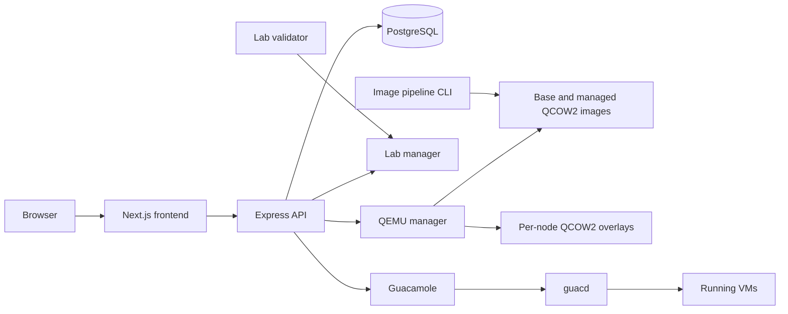

# SandLabX

SandLabX is a self-hosted network and systems lab platform built around QEMU/KVM, QCOW2 copy-on-write disks, Apache Guacamole, PostgreSQL, and a Next.js interface. It is designed for repeatable virtual labs that can be created, started, reset, and accessed from a browser.

This development branch adds a safer image lifecycle, a cloud-image catalog, ISO installer planning, topology-as-code validation, stronger local development tooling, optimized containers, and a more reliable Docker Compose startup sequence.

## Core capabilities

- QEMU/KVM virtual machines with per-node QCOW2 overlays
- Browser consoles through Apache Guacamole and serial WebSockets
- Visual lab topology editing
- PostgreSQL-backed node and lab state
- Authentication, RBAC, rate limits, and audit logging
- Custom image upload and conversion
- Reusable lab definitions and managed image manifests
- Versioned Lab Capsules with deterministic network plans and scenario checks

## New image pipeline

The developer CLI now handles the complete custom-image lifecycle without interpolating user input into shell commands:

- Inspect QEMU-supported disk formats
- Convert VMDK, VDI, VHD/VHDX, RAW, and IMG files to QCOW2
- Verify SHA-256 checksums
- Reject encrypted images and unsafe external backing files
- Publish converted images through staging files and atomic renames
- Prevent concurrent mutations with per-image lock files
- Compact and resize managed images
- Pull curated cloud images from `images/catalog.json`
- Generate deterministic ISO installation plans with VNC, CPU, memory, disk, and optional seed ISO settings

```bash
cd backend
npm run image:doctor
npm run image:list
npm run sandlabx -- image inspect ../downloads/appliance.vmdk
npm run sandlabx -- image import ../downloads/appliance.vmdk --name appliance
npm run sandlabx -- image pull ubuntu-24.04
npm run sandlabx -- image compact appliance
npm run sandlabx -- image resize appliance 40G
npm run sandlabx -- image plan-install ../isos/debian.iso --name debian-desktop --disk-size 32G
```

See [Managed image pipeline](docs/IMAGE-PIPELINE.md).

## Topology as code

Labs can be described as version-controlled JSON documents. Offline validation catches unknown nodes, duplicate interface use, self-links, invalid resource allocations, and aggregate resource overruns before deployment.

```bash
cd backend
npm run sandlabx -- lab validate ../examples/labs/basic-routing.json
npm run sandlabx -- lab normalize ../examples/labs/basic-routing.json /tmp/basic-routing.normalized.json
```

Normalization sorts nodes, links, and tags so Git diffs remain deterministic.

## Lab Capsules

Capsules are the canonical versioned model for new labs. They pin image digests, declare interface-level links, compile into instance-owned TAP/MAC/segment/QEMU plans, and support durable operation events, typed verification, and stopped-VM checkpoints. The authenticated workstation at `/capsules` now provides visual node creation, bounded resource allocation, interface-level wiring, validation, autosave with revision-conflict recovery, and explicit publication.

```bash
cd backend
npm run sandlabx -- capsule validate ../examples/capsules/ospf-failure-recovery/capsule.json --published
```

See [Lab Capsules](docs/CAPSULES.md) for the API and safety boundaries. The browser authoring surface is available at `/capsules` after authentication.

## Architecture


```mermaid
flowchart LR
    Browser[Browser] --> Frontend[Next.js frontend]
    Frontend --> API[Express API]
    API --> Postgres[(PostgreSQL)]
    API --> VM[QEMU manager]
    API --> Labs[Lab manager]
    API --> Guac[Guacamole]
    VM --> Images[Base and managed QCOW2 images]
    VM --> Overlays[Per-node QCOW2 overlays]
    Guac --> Guacd[guacd]
    Guacd --> VMs[Running VMs]
    ImageCLI[Image pipeline CLI] --> Images
    LabCLI[Lab validator] --> Labs
```

The intended boundaries are:

- **HTTP and authorization:** Express routes and middleware
- **Domain state:** node and lab managers
- **Virtualization:** QEMU process and overlay lifecycle
- **Image lifecycle:** conversion, validation, manifests, downloads, compaction, and installer planning
- **Console transport:** Guacamole and serial WebSockets
- **Tooling:** host doctor, CI, Make targets, and declarative lab validation

See [Architecture](docs/ARCHITECTURE.md).

## Requirements

- Linux host
- Docker Engine with the Compose plugin
- `/dev/kvm` for hardware acceleration
- `/dev/net/tun` for TAP networking
- 8 GB RAM recommended for multi-node labs
- Node.js 18+ for running developer tools outside Docker

## Quick start

```bash
git clone https://github.com/Zburgers/SandlabsX.git
cd SandlabsX
cp .env.example .env
make prepare
make doctor
make up
```

Open:

- Frontend: `http://localhost:2000`
- Backend health: `http://localhost:3001/api/health`
- API documentation: `http://localhost:3001/api/docs`
- Guacamole: `http://localhost:8081/guacamole`

Development credentials currently documented by the project are:

- Email: `admin@sandlabx.com`
- Password: `admin123`

Change all development credentials before exposing SandLabX outside a trusted local environment.

## Development workflow

```bash
make prepare
make doctor
make install
make test
make build
make up
make logs
```

The repository includes:

- A root `Makefile` for common operations
- `scripts/dev-doctor.sh` for KVM, TUN, QEMU, Docker, directory, and port checks
- Three CI gates: code quality, database migrations, and Compose bootstrap
- Service health dependencies so the backend does not race PostgreSQL initialization
- Configurable ports and credentials through `.env`
- Bounded Docker logs and graceful service shutdown
- An optimized standalone Next.js runtime image

## Image storage

```text
images/
├── catalog.json
├── ubuntu-24-lts.qcow2
└── custom/
    ├── appliance.qcow2
    ├── .manifests/appliance.json
    ├── .locks/
    └── .staging/

overlays/
└── <node-id>.qcow2
```

Base images are immutable templates. Each VM writes to its own overlay. Managed custom images are standalone QCOW2 files with checksums and sidecar manifests.

## Common commands

| Command | Purpose |
| --- | --- |
| `make doctor` | Verify host virtualization prerequisites |
| `make up` | Build and start the stack |
| `make down` | Stop the stack |
| `make logs` | Follow service logs |
| `make test` | Run backend tests |
| `make image-list` | List managed custom images |
| `docker compose ps` | Inspect service health |

## Configuration

Copy `.env.example` to `.env`.

| Variable | Default | Purpose |
| --- | --- | --- |
| `FRONTEND_PORT` | `2000` | Web interface port |
| `BACKEND_PORT` | `3001` | API port |
| `GUACAMOLE_PORT` | `8081` | Browser console gateway |
| `POSTGRES_PORT` | `5432` | Host database port |
| `JWT_SECRET` | development fallback | Token signing secret |
| `ALLOWED_ORIGINS` | `http://localhost:2000` | CORS allow-list |
| `SANDLABX_PRIVILEGED` | `false` | Legacy privileged backend mode |

## Repository map

```text
backend/
  cli/                  Image and lab tooling
  controllers/          HTTP controllers
  middleware/           Authentication, RBAC, and rate limits
  modules/              Domain and infrastructure services
  test/                 Node test runner suites
frontend/
  app/                   Next.js routes
  components/            UI components
  hooks/                 Client hooks
  lib/                   API client and shared types
docs/                    Architecture and operational guides
examples/labs/           Declarative lab specifications
images/                  Base images, catalog, and managed images
overlays/                Per-VM copy-on-write disks
scripts/                 Host and developer utilities
```

## Documentation

- [Quick start](QUICK-START.md)
- [Architecture](docs/ARCHITECTURE.md)
- [Managed image pipeline](docs/IMAGE-PIPELINE.md)
- [Backend](backend/README.md)
- [Frontend](frontend/README.md)
- [Project structure](STRUCTURE.md)

## Next architecture targets

1. Route browser image uploads through `ImagePipeline` so the API and CLI share one implementation.
2. Split the remaining large QEMU manager into process, network, console, and disk services.
3. Persist image manifests in PostgreSQL while retaining portable sidecars.
4. Add asynchronous image jobs with progress events.
5. Compile validated lab specs directly into deployable lab records.
6. Add VM snapshots, linked clones, and portable lab bundles.

## License

MIT. See [LICENSE](LICENSE).
