# SandLabX - Browser-Based Network Virtualization Platform

A production-ready network lab virtualization platform that enables users to create, manage, and access virtual machines through a modern web interface. Built with QEMU/KVM for bare-metal performance, Apache Guacamole for browser-based console access, and React for an intuitive user experience.

---

## 📚 Documentation Links

- **[Quick Start Guide](./QUICK-START.md)** - Get running in 1 command
- **[Persistence Architecture](./PERSISTENCE.md)** - VM data persistence explained
- **[Project Summary](./PROJECT-SUMMARY.md)** - Overview and deliverables
- **[Project Structure](./STRUCTURE.md)** - Directory layout
- **[Cheat Sheet](./CHEAT-SHEET.txt)** - Command reference
- **[Backend API Docs](./backend/README.md)** - API endpoints
- **[Frontend Docs](./frontend/README.md)** - UI components
- **[Documentation Index](./docs/README.md)** - All docs

---

## 🌟 Key Features

### Virtualization & Infrastructure
- **QEMU/KVM Integration** - Bare-metal VM performance with KVM acceleration
- **Copy-on-Write Overlays** - Instant VM provisioning using QCOW2 overlays
- **Multiple Base Images** - Ubuntu, Debian, Alpine, Fedora, Cisco Router support
- **Automatic ISO Conversion** - Install any OS from ISO and convert to QCOW2 base image
- **Dynamic Resource Allocation** - Configurable CPU (1-8 cores) and RAM (512MB-16GB) per VM

### Console Access
- **Serial Console** - WebSocket-based terminal streaming for CLI systems (routers, servers)
- **Guacamole VNC** - Browser-based graphical desktop access (no VNC client required)
- **Multi-Console Support** - Open multiple VM consoles simultaneously in separate tabs
- **Full Keyboard & Mouse** - Complete input passthrough with copy/paste support

### User Interface
- **Dashboard Mode** - Real-time VM management with status monitoring
- **Canvas Editor** - Visual network topology designer with drag-and-drop
- **Live Status Updates** - 5-second polling for real-time VM state synchronization
- **Responsive Design** - Modern dark-themed UI optimized for network labs

### Authentication & Security
- **JWT Authentication** - Token-based security with 24-hour validity
- **Role-Based Access Control (RBAC)** - Admin, Instructor, Student, Viewer roles
- **Audit Logging** - Comprehensive tracking of all user actions
- **HTTP-Only Cookies** - Secure JWT storage

### Advanced Features
- **Persistent Storage** - All VM data survives container restarts
- **Network Topology Export** - Save and restore complex lab configurations
- **Auto-Layout Algorithm** - Automatic network diagram organization using Dagre
- **Properties Panel** - Detailed node information and quick actions
- **Wipe & Reset** - Instant VM reset to clean state without reprovisioning

---

## 🏗️ Architecture

```mermaid
graph TB
    subgraph "User Browser"
        A["🌐 User Interface<br/>http://localhost:3000"]
    end
    
    subgraph "Frontend Layer"
        B["📱 Frontend UI<br/>Next.js 15 + React 19<br/>Canvas Editor + Dashboard"]
    end
    
    subgraph "Backend Layer"
        C["⚙️ Backend API<br/>Node.js + Express<br/>VM Lifecycle Management"]
        D["🔐 Authentication<br/>JWT Tokens<br/>Role-Based Access Control"]
        E["📊 Audit Logging<br/>Action Tracking<br/>Security Monitoring"]
    end
    
    subgraph "Virtualization Layer"
        F["⚡ QEMU/KVM Manager<br/>Overlay Management<br/>VM Orchestration"]
        G["💾 Base Images<br/>QCOW2 Files<br/>Ubuntu, Debian, Alpine, etc."]
        H["🔄 VM Overlays<br/>Copy-on-Write<br/>Per-VM Disks"]
    end
    
    subgraph "Database Layer"
        I["🗄️ PostgreSQL DB<br/>Guacamole Schema<br/>User & Connection Data"]
    end
    
    subgraph "Console Access Layer"
        J["🖥️ Apache Guacamole<br/>Browser-based Console<br/>VNC/SSH/RDP Gateway"]
        K["🔗 Guacd VNC Proxy<br/>Connection Broker<br/>Protocol Translation"]
    end
    
    subgraph "VM Instances"
        L["🖥️ VM Instance 1<br/>QEMU/KVM Process<br/>VNC:5900"]
        M["🖥️ VM Instance 2<br/>QEMU/KVM Process<br/>VNC:5901"]
        N["🖥️ VM Instance N<br/>QEMU/KVM Process<br/>VNC:59xx"]
    end

    %% Connections
    A -- "REST API (JWT)" --> B
    B -- "API Calls" --> C
    C -- "Authentication" --> D
    C -- "Log Events" --> E
    C -- "Manage VMs" --> F
    F -- "Reference" --> G
    F -- "Create/Manage" --> H
    F -- "Register Conn." --> I
    C -- "Store Data" --> I
    F -- "Start VMs" --> L
    F -- "Start VMs" --> M
    F -- "Start VMs" --> N
    L -- "VNC" --> K
    M -- "VNC" --> K
    N -- "VNC" --> K
    K -- "Proxy" --> J
    J -- "Browser Access" --> A
    
    %% Styling
    classDef frontend fill:#e1f5fe
    classDef backend fill:#f3e5f5
    classDef db fill:#e8f5e8
    classDef virtualization fill:#fff3e0
    classDef console fill:#fce4ec
    classDef vm fill:#fafafa
    
    class A,B frontend
    class C,D,E backend
    class I db
    class F,G,H virtualization
    class J,K console
    class L,M,N vm
```



**Technology Stack:**
- **Frontend:** Next.js 15, React 19, TypeScript, Tailwind CSS, React Flow
- **Backend:** Node.js 18+, Express.js, Pino (logging)
- **Database:** PostgreSQL 16
- **Virtualization:** QEMU/KVM, QCOW2 overlays
- **Console Server:** Apache Guacamole 1.5.4 + Guacd
- **Deployment:** Docker Compose

---

## 🚀 Quick Start

### Prerequisites

- **Docker & Docker Compose** - For running infrastructure services
- **Git** - For cloning the repository
- **4GB+ RAM** - Minimum for running multiple VMs
- **Ports Available:** 3000 (frontend), 3001 (backend), 8081 (guacamole), 5432 (postgres), 5900+ (VNC)

### Installation

```bash
# Clone the repository
git clone https://github.com/Zburgers/SandlabsX.git
cd SandlabsX

# Start all services
docker-compose up --build
```

That's it! The platform will automatically:
1. Build frontend and backend containers
2. Initialize PostgreSQL database with Guacamole schema
3. Start Guacamole and Guacd services
4. Launch the web interface

### Access the Platform

Once all containers are running, access the platform at:

**Frontend:** http://localhost:3000

**Default Credentials:**
- Email: `admin@sandlabx.com`
- Password: `admin123`

**Other Services:**
- Backend API: http://localhost:3001/api
- Guacamole Direct: http://localhost:8081/guacamole
- API Health Check: http://localhost:3001/api/health

---

## 📖 Complete User Guide

### 1. Login to SandLabX

Navigate to `http://localhost:3000` and log in with your credentials.


---

### 2. Dashboard Overview

After login, the main dashboard displays all your virtual machines with real-time status updates.


**Dashboard Features:**
- **Live Statistics** - Total nodes, running/stopped counts, total vCPU allocation
- **Node Cards** - Each VM displayed with OS type, resources, and status
- **Quick Actions** - Start, Stop, Wipe, Delete buttons per VM
- **Console Access** - Direct links to serial and VNC consoles
- **Add Node** - Quick VM creation wizard

---

### 3. Creating Virtual Machines

Click **"+ Add Node"** to create a new virtual machine.


**Configuration Options:**

**Operating System:**
- 🐧 Ubuntu Server 24.04 LTS
- 🌀 Debian 12 Bookworm
- 🏔️ Alpine Linux 3.X (lightweight)
- 🎩 Fedora Server
- 🌐 Cisco Router (IOS)

**Resources:**
- **vCPU:** 1-8 cores (adjustable slider)
- **RAM:** 512MB - 16GB (adjustable slider)

**Node Name:** Optional custom identifier (auto-generated if blank)

The system uses **QCOW2 copy-on-write overlays**, meaning:
- ⚡ **Instant provisioning** - No disk copying required
- 💾 **Efficient storage** - Only changes stored, not full disks
- 🧹 **Easy reset** - Wipe and recreate in seconds

---

### 4. Starting Virtual Machines

Click **"▶️ Start"** on any node to boot the VM.


**What Happens:**
1. QEMU process spawns with configured resources
2. VNC port allocated dynamically (5900, 5901, etc.)
3. VM boots from overlay disk (references base image)
4. Status updates to **"● Running"** (green indicator)
5. Console access buttons become active

**Run Multiple VMs:**


The platform supports multiple concurrent VMs with independent lifecycles. Each VM:
- Runs in isolated QEMU process
- Has dedicated VNC port
- Maintains separate overlay disk
- Shows real-time status updates

---

### 5. Console Access

#### Serial Console (CLI Systems)

For routers, servers, and CLI-based systems, click **"🖥️ Connect Console"** to access the serial terminal.


**Serial Console Features:**
- **WebSocket Streaming** - Real-time terminal output via `ws://localhost:3001`
- **Full Keyboard Input** - Complete shell interaction
- **ANSI Color Support** - Terminal colors and formatting
- **Copy/Paste** - Clipboard integration
- **Ctrl+Alt+Del** - Send system interrupt
- **Screenshot Capture** - Copy terminal content to clipboard

**Use Cases:**
- Cisco Router configuration
- Linux server administration
- Network device management
- Command-line workflows

---

#### VNC Console (Graphical Desktop)

For desktop environments, click **"🖥️ Connect Console"** to access the graphical interface via Apache Guacamole.


**VNC Console Features:**
- **Browser-Based** - No VNC client installation required
- **Apache Guacamole** - Industry-standard remote desktop gateway
- **Full GUI Access** - Complete desktop environment
- **Mouse & Keyboard** - Native input passthrough
- **Copy/Paste** - Clipboard synchronization (Ctrl+Alt+Shift)
- **Fullscreen Mode** - Immersive desktop experience
- **Multi-Tab Support** - Open multiple VMs in separate browser tabs

**Connection Details:**
- Protocol: VNC
- Port: Auto-assigned (5900, 5901, 5902, etc.)
- Status: Active/Connected indicator

---

### 6. Canvas Editor - Network Topology Designer

Click **"🎨 Canvas Editor"** in the top navigation to switch to visual topology mode.


**Canvas Editor Features:**

**Visual Representation:**
- All VMs displayed as draggable nodes on canvas
- Real-time status indicators (running = green, stopped = gray)
- OS-specific icons (router, server, desktop)
- Resource information overlay (vCPU, RAM)

**Navigation Controls:**
- 🔍+ **Zoom In** - Increase canvas magnification
- 🔍- **Zoom Out** - Decrease canvas magnification
- 📐 **Fit View** - Auto-center and fit all nodes
- 📊 **Auto Layout** - Algorithmic topology organization (Dagre layout)
- **Mini Map** - Bottom-right overview for large topologies

**Topology Management:**
- ➕ **Add Node** - Create new VM directly from canvas
- 📤 **Export Topology** - Save configuration as JSON
- 🗑️ **Delete Selected** - Remove selected nodes
- **Drag & Drop** - Arrange nodes manually

---

### 7. Node Properties Panel

Select any node in Canvas Editor to view detailed information.


**Properties Displayed:**
- **Name** - Unique node identifier (UUID-based)
- **OS Type** - Operating system with icon
- **Status** - Running/Stopped with color indicator
- **Resources** - vCPU cores and RAM allocation

**Quick Actions:**
- ⏹ **Stop** - Gracefully shutdown VM
- 🔄 **Wipe** - Reset to clean state (disabled while running)
- 🗑️ **Delete Node** - Remove VM completely

---

## 🔧 Advanced Features

### QEMU Copy-on-Write Overlays

SandLabX uses QEMU's QCOW2 overlay system for efficient storage:

**Base Image (Read-Only):**
```
images/ubuntu-24-lts.qcow2  (Shared across all Ubuntu VMs)
```

**Node Overlay (Per-VM):**
```
overlays/node_<uuid>.qcow2  → references base image
```

**Benefits:**
- ⚡ **Instant Creation** - No disk copying (sub-second provisioning)
- 💾 **Storage Efficient** - Only changes stored (10-50MB per VM vs 10GB base)
- 🔒 **Immutable Base** - Base images never modified
- 🧹 **Quick Wipe** - Delete overlay and recreate (2-3 seconds)

**Commands Used Internally:**
```bash
# Create overlay
qemu-img create -f qcow2 -b /images/ubuntu-24-lts.qcow2 -F qcow2 /overlays/node_abc123.qcow2

# Start VM
qemu-system-x86_64 \
  -enable-kvm \
  -m 2048 -smp 2 \
  -hda /overlays/node_abc123.qcow2 \
  -vnc 0.0.0.0:0 \
  -netdev user,id=net0 \
  -device e1000,netdev=net0
```

---

### Automatic ISO to QCOW2 Conversion

Install any operating system from ISO and convert to QCOW2 base image:

```bash
# 1. Place ISO file in images directory
cp ~/Downloads/bazzite-gnome.iso images/

# 2. Create empty QCOW2 disk
qemu-img create -f qcow2 images/bazzite-base.qcow2 40G

# 3. Start installation VM with VNC
qemu-system-x86_64 \
  -enable-kvm -m 4096 -smp 2 \
  -boot d -cdrom images/bazzite-gnome.iso \
  -hda images/bazzite-base.qcow2 \
  -vnc :1 &

# 4. Connect with VNC viewer and complete installation
vncviewer localhost:5901

# 5. After installation completes, your base image is ready
# Add to backend/modules/qemuManager.js baseImages object
```

**Supported OS Types:**
- Any Linux distribution (Ubuntu, Debian, Fedora, CentOS, Arch, etc.)
- BSD variants (FreeBSD, OpenBSD)
- Cisco IOS router images
- Windows (with proper licensing)
- Custom appliances (pfSense, OPNsense, etc.)

---

### Authentication & RBAC

**Role Hierarchy:**

| Role | Permissions |
|------|-------------|
| **Admin** | Full system access, user management, audit logs |
| **Instructor** | Create/manage labs, view all nodes, manage student access |
| **Student** | Access assigned labs, create/manage own nodes |
| **Viewer** | Read-only access to labs and nodes |

**JWT Token Lifecycle:**
1. User logs in via `/auth/login`
2. Backend validates credentials against PostgreSQL
3. JWT token generated with user ID, email, role (24-hour expiry)
4. Token stored in HTTP-only cookie (secure)
5. All API requests validated via middleware
6. Token refresh available via `/auth/refresh`

**Audit Logging:**
All actions tracked in `audit_log` table:
- User login/logout events
- Node create/start/stop/delete operations
- Lab creation and modifications
- Role changes
- Access violations

---

### Network Topology Export/Import

**Export Topology:**
```json
{
  "version": "1.0",
  "name": "Web Server Lab",
  "created": "2026-02-09T08:30:00Z",
  "nodes": [
    {
      "id": "node-abc123",
      "name": "web-server-1",
      "osType": "ubuntu",
      "position": { "x": 100, "y": 200 },
      "resources": { "cpu": 2, "ram": 2048 }
    },
    {
      "id": "node-def456",
      "name": "database-1",
      "osType": "debian",
      "position": { "x": 400, "y": 200 },
      "resources": { "cpu": 4, "ram": 4096 }
    }
  ],
  "connections": [
    {
      "source": "node-abc123",
      "target": "node-def456",
      "type": "network"
    }
  ]
}
```

**Import Workflow:**
1. Click **"📤 Export Topology"** to save current configuration
2. Share JSON file with other users
3. Click **"Import"** and select JSON file
4. System recreates entire lab (nodes + layout)

---

## 🛠️ Configuration

### Environment Variables

**Backend (.env):**
```env
# Server Configuration
PORT=3001
NODE_ENV=production

# Database (PostgreSQL)
DB_HOST=postgres
DB_PORT=5432
DB_NAME=guacamole_db
DB_USER=guacamole_user
DB_PASSWORD=guacamole_pass

# JWT Authentication
JWT_SECRET=your-secure-secret-key-change-in-production
JWT_EXPIRES_IN=24h

# Guacamole
GUAC_BASE_URL=http://guacamole:8080/guacamole

# QEMU/KVM
BASE_IMAGES_PATH=/images
OVERLAYS_PATH=/overlays
VNC_START_PORT=5900
```

**Frontend (.env.local):**
```env
NEXT_PUBLIC_API_URL=http://localhost:3001/api
NEXT_PUBLIC_WS_URL=ws://localhost:3001
```

---

### Docker Compose Configuration

Key services and volumes:

```yaml
services:
  frontend:
    build: ./frontend
    ports:
      - "3000:3000"
    environment:
      - NEXT_PUBLIC_API_URL=http://localhost:3001/api

  backend:
    build: ./backend
    ports:
      - "3001:3001"
    volumes:
      - ./overlays:/overlays
      - ./images:/images
      - backend_state:/app/state
    privileged: true  # Required for KVM

  postgres:
    image: postgres:16
    volumes:
      - postgres_data:/var/lib/postgresql/data

  guacamole:
    image: guacamole/guacamole:1.5.4
    ports:
      - "8081:8080"
    depends_on:
      - postgres
      - guacd

  guacd:
    image: guacamole/guacd:1.5.4
    ports:
      - "4822:4822"

volumes:
  postgres_data:
  backend_state:
```

---

## 📡 API Endpoints

### Authentication
- `POST /auth/register` - Create new user account
- `POST /auth/login` - Authenticate and receive JWT token
- `POST /auth/refresh` - Refresh JWT token before expiry
- `POST /auth/logout` - Invalidate current session
- `GET /auth/me` - Get current user profile

### Lab Management
- `POST /api/labs` - Create new lab
- `GET /api/labs` - List all labs (RBAC filtered)
- `GET /api/labs/:id` - Get lab details
- `PUT /api/labs/:id` - Update lab configuration
- `DELETE /api/labs/:id` - Delete lab
- `POST /api/labs/:id/export` - Export lab topology
- `POST /api/labs/import` - Import lab from JSON

### Node Operations (VMs)
- `POST /api/nodes` - Create new VM (provision overlay)
- `GET /api/nodes` - List all nodes with status
- `GET /api/nodes/:id` - Get specific node details
- `POST /api/nodes/:id/run` - Start VM (boot QEMU)
- `POST /api/nodes/:id/stop` - Stop VM (graceful shutdown)
- `POST /api/nodes/:id/reboot` - Reboot VM
- `DELETE /api/nodes/:id` - Delete VM completely
- `POST /api/nodes/:id/wipe` - Wipe and recreate overlay
- `GET /api/nodes/:id/console` - Get console URL (Guacamole)

### Image Management
- `GET /api/images` - List available base images
- `POST /api/images/upload` - Upload custom QCOW2 image
- `DELETE /api/images/:id` - Remove base image

### System
- `GET /api/health` - Health check and server status
- `GET /api/system/stats` - Resource usage (CPU, RAM, disk)
- `GET /api/audit-log` - View audit trail (admin only)

### Example Usage

```bash
# Health check
curl http://localhost:3001/api/health

# Create node
curl -X POST http://localhost:3001/api/nodes \
  -H "Content-Type: application/json" \
  -H "Authorization: Bearer <jwt-token>" \
  -d '{
    "name": "web-server-1",
    "osType": "ubuntu",
    "cpu": 2,
    "ram": 2048
  }'

# Start node
curl -X POST http://localhost:3001/api/nodes/<node-id>/run \
  -H "Authorization: Bearer <jwt-token>"

# Get console URL
curl http://localhost:3001/api/nodes/<node-id>/console \
  -H "Authorization: Bearer <jwt-token>"
```

---

## 🧪 Development

### Running Locally

```bash
# Terminal 1: Start Docker services
docker-compose up -d postgres guacamole guacd

# Terminal 2: Start backend
cd backend
npm install
npm start

# Terminal 3: Start frontend
cd frontend
npm install
npm run dev
```

**Hot Reload:**
- Frontend: Next.js Fast Refresh on file changes
- Backend: Nodemon restarts server on file changes

### Database Access

```bash
# Connect to PostgreSQL
docker exec -it sandlabx-postgres psql -U guacamole_user -d guacamole_db

# View nodes
SELECT id, name, status, vnc_port FROM nodes;

# View audit logs
SELECT * FROM audit_log ORDER BY timestamp DESC LIMIT 10;
```

### Logs

```bash
# View all logs
docker-compose logs -f

# Specific service
docker-compose logs -f backend
docker-compose logs -f guacamole

# Backend logs (if running locally)
tail -f backend/logs/app.log
```

---

## 🔐 Security Notes

**Production Deployment Checklist:**

⚠️ This is a development setup. For production:

- [ ] Change all default passwords (Guacamole, PostgreSQL, admin user)
- [ ] Use strong JWT secret (minimum 32 characters, random)
- [ ] Enable HTTPS/TLS with valid SSL certificates
- [ ] Configure firewall rules (only expose 443/80, block 3001/8081/5432)
- [ ] Remove `privileged: true` from Docker Compose (use device passthrough)
- [ ] Enable PostgreSQL SSL connections
- [ ] Implement rate limiting on all API endpoints
- [ ] Configure CORS for production domain only
- [ ] Enable audit logging and monitoring
- [ ] Regular security updates for base images
- [ ] Implement backup strategy for PostgreSQL and overlays

---

## 📊 Performance Metrics

**VM Provisioning:**
- Create node: ~50ms (overlay creation)
- Start VM: ~3-5 seconds (includes boot time)
- Stop VM: ~1-2 seconds (graceful shutdown)
- Delete node: ~20ms (cleanup)
- Wipe node: ~2-3 seconds (recreate overlay)

**Console Access:**
- Serial console connect: ~100ms (WebSocket negotiation)
- VNC console connect: ~200ms (Guacamole proxy)
- Input latency: <50ms (local network)

**Resource Overhead:**
- Base image: 290MB (Fedora) - 2.5GB (Ubuntu Desktop)
- Overlay per VM: ~10-50MB (only changes stored)
- Backend memory: ~100MB
- Frontend memory: ~50MB
- Guacamole: ~200MB

**Concurrent VMs:**
- System capacity: 10-15 VMs (depends on host RAM)
- VNC port range: 5900-5950 (configurable)
- CPU: KVM uses host CPU directly (near-native performance)

---

## 📚 Documentation

- **[Architecture Deep Dive](./AGENTS.md)** - Complete project context and implementation details
- **[API Documentation](./backend/README.md)** - Detailed API endpoint reference
- **[Frontend Components](./frontend/README.md)** - React component documentation
- **[Persistence Model](./PERSISTENCE.md)** - Data storage and state management

---

## 🤝 Contributing

We welcome contributions! Please follow these guidelines:

1. Fork the repository
2. Create a feature branch (`git checkout -b feature/amazing-feature`)
3. Commit your changes (`git commit -m 'feat: Add amazing feature'`)
4. Push to the branch (`git push origin feature/amazing-feature`)
5. Open a Pull Request

**Commit Convention:** Use conventional commits (feat, fix, docs, style, refactor, test, chore)

---

## 📝 License

This project is open source and available for educational and commercial use.

---

## 🔗 Repository

**GitHub:** https://github.com/Zburgers/SandlabsX

```bash
git clone https://github.com/Zburgers/SandlabsX.git
cd SandlabsX
docker-compose up --build
```

---

**Built with ❤️ for network engineers, students, and lab enthusiasts**

- [ ] Change all default passwords (Guacamole, PostgreSQL, admin user)
- [ ] Use strong JWT secret (minimum 32 characters, random)
- [ ] Enable HTTPS/TLS with valid SSL certificates
- [ ] Configure firewall rules (only expose 443/80, block 3001/8081/5432)
- [ ] Remove `privileged: true` from Docker Compose (use device passthrough)
- [ ] Enable PostgreSQL SSL connections
- [ ] Implement rate limiting on all API endpoints
- [ ] Configure CORS for production domain only
- [ ] Enable audit logging and monitoring
- [ ] Regular security updates for base images
- [ ] Implement backup strategy for PostgreSQL and overlays

